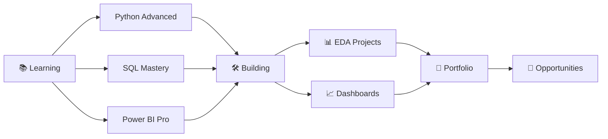

<div align="center">

<!-- Animated Banner -->


<!-- Typing SVG -->


<br/>

<!-- Badges Row -->
[](https://www.linkedin.com/in/md-matloob-a-016408229/)
[](https://github.com/alam292)
[](https://github.com/alam292)
[](https://youtu.be/9qZFpN81k6o)

</div>

---

## 👨‍💻 About Me


```yaml
Name      : Md MatlooB Alam
Role      : Aspiring Data Analyst
Location  : India 🇮🇳
Learning  : Data Analytics & Visualization
Focus     : Python | SQL | Power BI | Tableau
Goal      : Turn Raw Data into Actionable Insights
Status    : Open to Opportunities ✅
```

- 🔭 Currently working on **Data Analytics Projects**
- 🌱 Learning **Advanced SQL**, **Power BI**, and **Machine Learning**
- 💡 Passionate about **data storytelling** and **visual analytics**
- 📫 Reach me at **[LinkedIn](https://www.linkedin.com/in/md-matloob-a-016408229/)**
- ⚡ Fun fact: *"Without data, you're just another person with an opinion."*

<br clear="right"/>

---

## 🏆 GitHub Trophies

<div align="center">

[](https://github.com/ryo-ma/github-profile-trophy)

</div>

---

## 🛠️ Tech Stack & Tools

<div align="center">

### 💻 Languages


### 📊 Data & Analytics


### 🗄️ Databases


### 📈 BI & Visualization Tools


### 🧰 Tools & Platforms


</div>

---

## 📊 GitHub Statistics

<div align="center">


<br/>


</div>

---

## 📈 Contribution Graph

<div align="center">

[](https://github.com/ashutosh00710/github-readme-activity-graph)

</div>

---

## 🎯 Current Goals & Roadmap



---

## 🤝 Connect With Me

<div align="center">

[](https://www.linkedin.com/in/md-matloob-a-016408229/)
[](https://github.com/alam292)
[](https://youtu.be/9qZFpN81k6o)

<br/>


</div>

---

<div align="center">
  <i>⭐ If you find my work interesting, feel free to star my repos and connect!</i>
  <br/>
  <b>"Programming is easy to learn but difficult to master." — Md MatlooB Alam</b>
</div>
